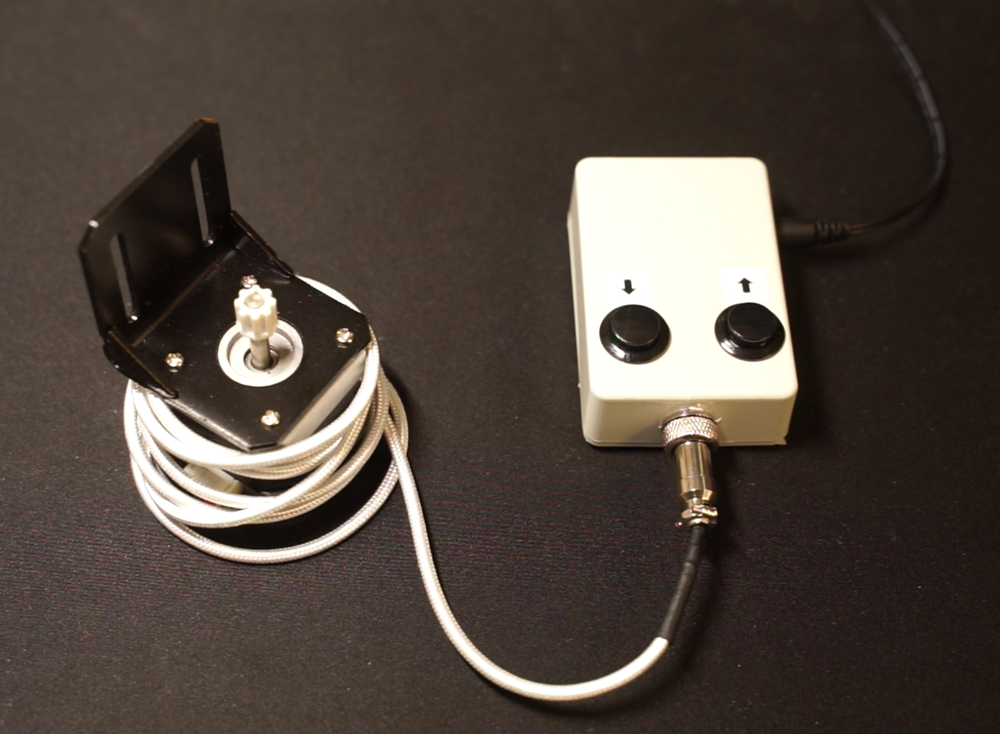

# tasmotashades

This is an integrated PCB for automating shades with one Nema 17 stepper motor.
I used the original Nema mounting brackets and some stock roller shades.

The controller is based on a nodeMCU and it is designed to work with Tasmota.
Therefore, it is wifi enabled and can be integrated in several different home automation server systems (e.g., by using MQTT).
Further reading for configuring Tasmota can be found here:
https://tasmota.github.io/docs/Blinds-and-Shutters/#using-stepper-motors

Please use Kicad https://www.kicad.org/ for viewing and exporting the PCB schematics.